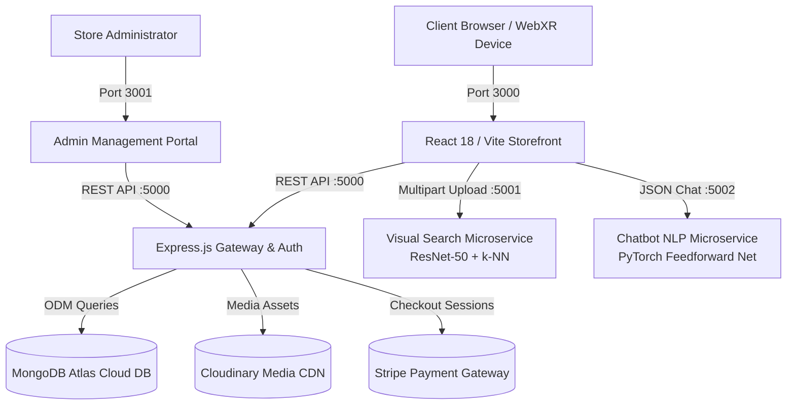

# 🛋️ iFurnish Shop — Next-Gen AI & WebXR Furniture E-Commerce Ecosystem

[](https://react.dev/)
[](https://threejs.org/)
[](https://nodejs.org/)
[](https://www.mongodb.com/)
[](https://pytorch.org/)
[](https://tensorflow.org/)
[](https://stripe.com/)
[](LICENSE)

> **Academic Project:** CSE6035 Development Project (WRIT1 – 80% Weighting)  
> **Institution:** Cardiff Metropolitan University / School of Technologies  
> **Student:** S.M.D.G Channa Kavishka Sandaruwan (ID: `St20305908`)

---

## 📌 Executive Summary

**iFurnish Shop** is an intelligent, full-stack e-commerce platform developed to bridge the spatial visualization and discovery gaps inherent in traditional online furniture retail. The platform unifies:
1. **Interactive 3D WebGL / WebXR Parametric Customization** for spatial fitting, material swaps, and real-time pricing.
2. **Deep Convolutional Visual Similarity Search (ResNet-50 + $k$-NN)** across 14,123 furniture items.
3. **Domain-Specific Conversational AI (PyTorch Neural NLP)** with intent classification and fallback handling.
4. **Enterprise E-Commerce Engine** featuring MongoDB Atlas, Stripe payment verification, Cash on Delivery (COD), and a dedicated Admin Management Portal.

---

## 🏗️ System Architecture



---

## 🌟 Key Features & Capabilities

### 🛋️ 1. Interactive 3D WebGL & WebXR Customizer
* **Parametric Dimension Scaling:** Real-time mesh scaling along $X, Y, Z$ axes ($1.0\times - 1.8\times$) via `@react-three/fiber` and `@react-three/drei`.
* **Physically-Based Rendering (PBR):** Dynamic shader swapping across wood, velvet, leather, and metal finishes with real-time normal and roughness maps.
* **Synchronized Price Recalculation:** Dynamic calculation formula $P_{\text{custom}} = P_{\text{base}} \times (1 + \Delta_{\text{dim}} \times \alpha)$ updating instantly on client and cart.
* **Asynchronous GLTF/GLB Asset Streaming:** Progressive 3D asset delivery with memory-safe disposal.

### 🔍 2. ResNet-50 Deep Visual Search & Recommendations
* **Pre-trained CNN Feature Extraction:** 2,048-dimensional dense feature embeddings extracted from pre-trained ResNet-50 models.
* **$k$-Nearest Neighbors ($k$-NN) Index:** Brute-force Euclidean distance search across 14,123 catalog vectors with $O(N \cdot D)$ time complexity.
* **Distance Deduplication:** 4-decimal precision duplicate filter ensuring recommendations display distinct furniture alternatives.
* **Sub-2-Second Response Time:** Fast visual similarity queries ($~1.34\text{s}$ average latency).

### 💬 3. Conversational PyTorch NLP Chatbot
* **Neural Intent Classification:** 3-layer Feedforward Neural Network (`input_size` $\rightarrow$ 8 hidden units $\rightarrow$ `num_classes`) trained on domain-specific e-commerce intents.
* **Confidence Gating & Safe Fallback:** Softmax threshold ($\tau = 0.75$) intercepting ambiguous or out-of-domain queries.
* **Ultra-Low Latency:** Average inference latency of **$< 2\text{ms}$** directly on CPU.

### 🛒 4. Full-Stack Commerce & Admin Management
* **Dual Payment Processing:** Integrated Stripe Hosted Checkout sessions and Cash on Delivery (COD) workflows.
* **Live Cart Synchronization:** Instant merge of guest cart items upon JWT user authentication.
* **Admin Portal (`:3001`):** Complete product ingestion pipeline with Cloudinary image hosting, category taggers, stock management, and live order status mutation.

### 🛡️ 5. Enterprise Security & Hardening
* **Password Hashing:** Salted `bcryptjs` with 10 salt rounds ($2^{10} = 1024$ cost factor).
* **JWT Stateless Route Guards:** Middleware intercepting unauthenticated or tampered session requests.
* **NoSQL Injection Defense:** Mongoose schema parameterization preventing query selector bypass (`$ne`, `$gt`).
* **CORS Origin Boundary:** Express origin whitelist isolating Storefront (`:3000`) and Admin (`:3001`).

---

## 🔌 Microservices & Port Allocation

| Port | Service Name | Technology Stack | Purpose / Primary Route |
| :--- | :--- | :--- | :--- |
| **`3000`** | **Storefront Web App** | React 18, Vite, TailwindCSS, Three.js | Customer Storefront (`http://localhost:3000`) |
| **`3001`** | **Admin Portal** | React 18, Vite, TailwindCSS | Store Management Dashboard (`http://localhost:3001`) |
| **`5000`** | **Core REST Backend** | Node.js, Express.js, Mongoose, JWT | API Gateway (`http://localhost:5000/api`) |
| **`5001`** | **Visual Search Engine** | Python, Flask, TensorFlow, ResNet-50 | Image Recommendations (`POST /recommend`) |
| **`5002`** | **NLP Chatbot Service** | Python, Flask, PyTorch, NLTK | Customer Support Bot (`POST /chat`) |

---

## 🚀 Quick Start Guide

### Prerequisites
* **Node.js** (v18.0.0 or higher) & **npm**
* **Python** (v3.10 or v3.11 recommended)
* **Git**

---

### Step 1: Clone the Repository
```bash
git clone https://github.com/C-KAVISHKA/iFurnish_Shop.git
cd iFurnish_Shop
```

---

### Step 2: Configure Environment Variables

Create `.env` inside `backend/`:
```env
# backend/.env
PORT=5000
MONGODB_URI=your_mongodb_atlas_connection_string
JWT_SECRET=your_super_secret_jwt_key
CLOUDINARY_NAME=your_cloudinary_name
CLOUDINARY_API_KEY=your_cloudinary_key
CLOUDINARY_SECRET_KEY=your_cloudinary_secret
STRIPE_SECRET_KEY=your_stripe_secret_key
ADMIN_EMAIL=admin@ifurnishshop.com
ADMIN_PASSWORD=admin123
```

---

### Step 3: Install & Start Microservices

Open 5 terminal windows (or use background processes):

#### Terminal 1 — Core Backend (Port 5000)
```bash
cd backend
npm install
npm run dev
```

#### Terminal 2 — Visual Search Microservice (Port 5001)
```bash
cd "furniture recommendation"
python -m venv venv
.\venv\Scripts\activate      # On Linux/Mac: source venv/bin/activate
pip install -r requirements.txt
python app.py
```

#### Terminal 3 — NLP Chatbot Microservice (Port 5002)
```bash
cd chatbot/chatbot-deployment
python -m venv venv
.\venv\Scripts\activate      # On Linux/Mac: source venv/bin/activate
pip install -r requirements.txt
python app.py
```

#### Terminal 4 — Storefront Web App (Port 3000)
```bash
cd frontend
npm install
npm run dev
```

#### Terminal 5 — Admin Management Portal (Port 3001)
```bash
cd admin
npm install
npm run dev
```

---

## 🧪 Live System Verification Commands (PowerShell)

You can verify that all security guards, APIs, and AI models are operational by running these commands:

### 1. Verify Active Ports
```powershell
Get-NetTCPConnection -State Listen | Where-Object { $_.LocalPort -in 3000, 3001, 5000, 5001, 5002 } | Select-Object LocalPort, State
```

### 2. Verify Bcrypt Security & Hash Length (TC-19)
```powershell
node -e "const bcrypt = require('./backend/node_modules/bcryptjs'); const hash = bcrypt.hashSync('Password123!', 10); console.log('Hash:', hash); console.log('Length:', hash.length); console.log('Valid:', bcrypt.compareSync('Password123!', hash));"
```

### 3. Verify Missing JWT Rejection (TC-20)
```powershell
curl.exe -s -X POST http://localhost:5000/api/cart/get -H "Content-Type: application/json" -d "{}"
```

### 4. Verify NoSQL Injection Defense (TC-22)
```powershell
python -c "import requests; r = requests.post('http://localhost:5000/api/user/login', json={'email': {'$ne': None}, 'password': {'$ne': None}}); print('Status: HTTP', r.status_code); print('Response:', r.json())"
```

### 5. Verify ResNet-50 Visual Search Engine (TC-24 & TC-25)
```powershell
curl.exe -s -X POST http://localhost:5001/recommend -F "image=@furniture recommendation/chair1.jpg"
```

### 6. Verify PyTorch Chatbot NLP Microservice (TC-27 & TC-28)
```powershell
Invoke-RestMethod -Uri "http://localhost:5002/chat" -Method Post -ContentType "application/json" -Body '{"message": "What is your return policy?"}'
```

---

## 📂 Project Directory Structure

```text
iFurnish_Shop/
├── admin/                     # Admin Portal (React 18 / Vite / TailwindCSS)
│   ├── src/components/        # Admin Sidebar, Navbar, Login
│   └── src/pages/             # Add Product, List Products, Orders Management
├── backend/                   # Core Backend (Node.js / Express.js / Mongoose)
│   ├── controllers/           # User, Product, Cart, and Order Controllers
│   ├── middleware/            # JWT Auth & Admin Route Protection
│   ├── models/                # MongoDB Schema Definitions
│   └── routes/                # Express API Route Handlers
├── chatbot/                   # Conversational AI (Flask / PyTorch / NLTK)
│   └── chatbot-deployment/    # Intent classifier, data.pth, chat.py, app.py
├── frontend/                  # Storefront (React 18 / Vite / Three.js / WebXR)
│   ├── public/models/         # 3D GLB Asset Files (Chairs, Tables, Sofas)
│   ├── src/components/        # 3D WebGL Canvas, Header, Footer, Hero, Cart
│   ├── src/pages/             # Collection, Product Details, AR Viewer, AI Assistant
│   └── src/utils/             # 3D Model Mapper (modelMapper.js)
└── furniture recommendation/  # Visual Search API (Flask / ResNet-50 / k-NN)
    ├── app.py                 # Feature extractor & k-NN endpoint
    └── Image_features.pkl     # Pre-computed 2048-D feature vectors (14,123 items)
```

---

## 📄 Academic Citation & Project Details

```bibtex
@thesis{sandaruwan2026ifurnish,
  author       = {S.M.D.G Channa Kavishka Sandaruwan},
  title        = {iFurnish Shop: An Intelligent WebXR and Deep Learning Augmented Furniture E-Commerce Ecosystem},
  school       = {Cardiff Metropolitan University, School of Technologies},
  year         = {2026},
  type         = {BSc (Hons) Development Project Dissertation},
  number       = {CSE6035},
  note         = {Student ID: St20305908}
}
```

---

## ⚖️ License
This project is developed for academic and educational purposes under the **MIT License**. See the [LICENSE](LICENSE) file for more details.
